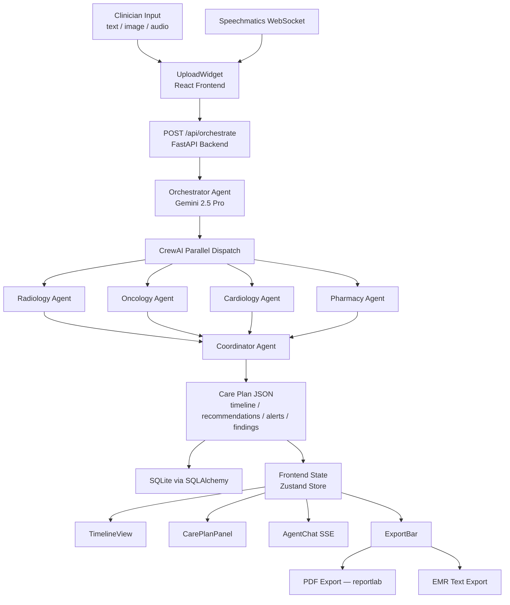

# CareFlow Orchestrator

A multi-agent clinical decision support platform that transforms clinician-provided inputs — typed notes, uploaded images, and spoken audio — into unified, cross-specialty care plans powered by Gemini 2.5 Pro and CrewAI.

Built for the **AI Agent Olympics at Milan AI Week 2026**.

**Live demo:** Frontend on [Vercel](https://vercel.com) · Backend on [Render](https://render.com)

---

## Project Overview

CareFlow Orchestrator accepts a patient case as free-text, an image (e.g. chest X-ray, ECG), or dictated audio. A Gemini 2.5 Pro **Orchestrator Agent** decomposes the case and identifies which medical specialties are relevant. It then dispatches up to four parallel **Specialty Agents** (Radiology, Oncology, Cardiology, Pharmacy) via CrewAI. A **Coordinator Agent** reconciles their findings into a structured **Care Plan** containing:

- A chronological **timeline** of recommended actions
- A **recommendations** list
- An **alerts** list (drug interactions, critical findings, agent failures)
- **Findings** grouped by specialty

The React frontend presents the care plan in a three-panel dashboard and supports PDF and EMR text export.

---

## Architecture



### Directory Structure

```
careflow/
├── backend/
│   ├── main.py                  # FastAPI app entry point
│   ├── database.py              # SQLAlchemy engine + init_db()
│   ├── models.py                # Case, Guideline ORM models
│   ├── schemas.py               # Pydantic request/response schemas
│   ├── requirements.txt
│   ├── .env.example
│   ├── agents/
│   │   ├── orchestrator.py      # Decomposes case, identifies specialties
│   │   ├── radiology.py
│   │   ├── oncology.py
│   │   ├── cardiology.py
│   │   ├── pharmacy.py
│   │   └── coordinator.py       # Reconciles findings into Care Plan
│   ├── routers/
│   │   ├── orchestrate.py       # POST /api/orchestrate, GET /api/export/*
│   │   ├── cases.py             # GET /api/cases, GET /api/cases/samples
│   │   ├── chat.py              # GET /api/chat/{case_id} (SSE)
│   │   └── speech.py            # WS /api/speech/transcribe
│   ├── services/
│   │   ├── gemini.py            # Gemini 2.5 Pro client (multimodal)
│   │   ├── speechmatics.py      # Speechmatics WebSocket client
│   │   ├── crew.py              # CrewAI orchestration flow
│   │   ├── export.py            # PDF + EMR text export
│   │   └── data_loader.py       # Loads guidelines.json / sample_cases.json
│   └── data/
│       ├── guidelines.json      # Specialty clinical guidelines
│       └── sample_cases.json    # Pre-loaded demo cases
├── frontend/
│   ├── src/
│   │   ├── components/
│   │   │   ├── Dashboard.tsx    # Three-panel layout
│   │   │   ├── UploadWidget.tsx # Text / image / mic input
│   │   │   ├── TimelineView.tsx # Vertical care timeline
│   │   │   ├── CarePlanPanel.tsx# Findings / recommendations / alerts
│   │   │   ├── AgentChat.tsx    # Real-time agent message stream
│   │   │   ├── SampleCases.tsx  # Demo case selector
│   │   │   └── ExportBar.tsx    # PDF / EMR export buttons
│   │   ├── hooks/
│   │   │   ├── useOrchestrate.ts
│   │   │   └── useSpeech.ts
│   │   ├── store/caseStore.ts   # Zustand global state
│   │   └── types/index.ts       # Shared TypeScript types
│   ├── package.json
│   └── vite.config.ts
├── docker-compose.yml
└── README.md
```

---

## Prerequisites

| Requirement | Version | Notes |
|---|---|---|
| Docker | 24+ | Includes Docker Compose v2 |
| Docker Compose | 2.x | `docker compose` (no hyphen) |
| Gemini API key | — | [Get one at ai.google.dev](https://ai.google.dev) |
| Speechmatics API key | — | [Get one at speechmatics.com](https://www.speechmatics.com) — required only for voice input |

> **No local Python or Node.js installation is required** when running via Docker Compose.

---

## Setup

### 1. Clone the repository

```bash
git clone https://github.com/HiImSunny/careflow.git
cd careflow
```

### 2. Create your environment file

```bash
cp backend/.env.example .env
```

Open `.env` and fill in your API keys:

```dotenv
GEMINI_API_KEY=your_gemini_api_key_here
SPEECHMATICS_API_KEY=your_speechmatics_api_key_here
DATABASE_URL=sqlite:///./careflow.db
```

> `SPEECHMATICS_API_KEY` can be left blank if you do not need voice input — all other features will work without it.

---

## Running

### Start both services with Docker Compose

```bash
docker compose up --build
```

| Service | URL |
|---|---|
| Frontend (React + Vite) | http://localhost:5173 |
| Backend API (FastAPI) | http://localhost:8000 |
| API docs (Swagger UI) | http://localhost:8000/docs |
| Health check | http://localhost:8000/health |

The backend automatically initializes the SQLite database on first startup — no manual migration step is needed.

To run in detached mode:

```bash
docker compose up --build -d
docker compose logs -f   # tail logs
docker compose down      # stop and remove containers
```

---

## Sample Cases

Three pre-loaded clinical scenarios are available in the left panel of the dashboard under **Sample Cases**. Click any card to populate the input field, then click **Submit** to run the full orchestration pipeline.

| Case | Specialties | Scenario |
|---|---|---|
| Chest Pain with Imaging | Cardiology, Radiology | 65-year-old male with ST-elevation and crushing chest pain |
| Lung Mass with Medication Review | Radiology, Oncology, Pharmacy | 58-year-old female with spiculated right upper lobe mass and medication interactions |
| Multi-Specialty Complex Case | All four specialties | 72-year-old male with CAD, new DLBCL diagnosis, and R-CHOP consideration |

You can also type or paste your own clinical note directly into the text area, optionally attach an image (drag-and-drop or click to browse), and click **Submit**.

---

## API Reference

All endpoints are prefixed with `/api`. The interactive Swagger UI is available at `http://localhost:8000/docs`.

### `POST /api/orchestrate`

Run the multi-agent orchestration pipeline for a clinical case.

**Request body** (`application/json`):

```json
{
  "text": "65-year-old male with chest pain...",
  "image_b64": "<base64-encoded image, optional>",
  "case_id": "<client-generated UUID, optional>"
}
```

At least one of `text` or `image_b64` must be present (returns `422` otherwise).

**Response** (`200 OK`):

```json
{
  "case_id": "550e8400-e29b-41d4-a716-446655440000",
  "timeline": [
    { "timestamp": "2024-01-01T10:00:00Z", "specialty": "cardiology", "description": "..." }
  ],
  "recommendations": ["..."],
  "alerts": ["..."],
  "findings": {
    "cardiology": { "specialty": "cardiology", "summary": "...", "action_items": ["..."] }
  }
}
```

**Error responses:**

| Status | Condition |
|---|---|
| `422` | No input provided |
| `502` | Gemini API error |
| `500` | Orchestration or persistence error |

---

### `GET /api/cases`

Returns all previously submitted cases (newest first), each with its deserialized Care Plan.

---

### `GET /api/cases/samples`

Returns the three pre-loaded sample cases from `backend/data/sample_cases.json`.

---

### `GET /api/chat/{case_id}`

Streams real-time agent messages for a case as **Server-Sent Events**. Connect with `EventSource` in the browser. Each event carries a JSON-encoded `AgentMessage`:

```json
{ "agent": "radiology", "content": "Analyzing imaging findings...", "timestamp": "..." }
```

A final event with `"type": "complete"` is sent when orchestration finishes.

---

### `WS /api/speech/transcribe`

WebSocket endpoint for real-time audio transcription via Speechmatics. Send raw PCM audio bytes; receive partial transcript strings. Send the text `"stop"` to end the session.

---

### `GET /api/export/pdf/{case_id}`

Download the Care Plan for a stored case as a formatted PDF file.

---

### `GET /api/export/emr/{case_id}`

Download the Care Plan for a stored case as a structured plain-text EMR file.

---

### `GET /health`

Returns `{ "status": "ok" }`. Useful for container health checks.

---

## Development

Running the services locally without Docker requires Python 3.11+ and Node.js 20+.

### Backend

```bash
cd backend

# Create and activate a virtual environment
python -m venv .venv
source .venv/bin/activate      # macOS / Linux
.venv\Scripts\activate         # Windows

# Install dependencies
pip install -r requirements.txt

# Copy and configure environment variables
cp .env.example .env
# Edit .env and add your API keys

# Start the development server
uvicorn backend.main:app --reload --host 0.0.0.0 --port 8000
```

The API will be available at `http://localhost:8000` and auto-reloads on file changes.

### Frontend

```bash
cd frontend

# Install dependencies
npm install

# Start the Vite dev server
npm run dev
```

The frontend will be available at `http://localhost:5173`. The Vite proxy forwards `/api/*` requests to `http://localhost:8000`, so the backend must be running.

### Running Tests

**Backend (pytest + Hypothesis):**

```bash
cd backend
pytest
```

**Frontend (Vitest + fast-check):**

```bash
cd frontend
npm test
```

---

## Deployment

### Backend → Render

1. Push the repo to GitHub
2. Create a new **Web Service** on [Render](https://render.com)
3. Set **Root Directory** to `backend`
4. Set **Build Command**: `pip install -r requirements.txt`
5. Set **Start Command**: `uvicorn main:app --host 0.0.0.0 --port $PORT`
6. Add environment variables in the Render dashboard:
   - `GEMINI_API_KEY`
   - `SPEECHMATICS_API_KEY`
   - `DATABASE_URL` (use a persistent disk path, e.g. `/data/careflow.db`)

### Frontend → Vercel

1. Import the repo on [Vercel](https://vercel.com)
2. Set **Root Directory** to `frontend`
3. Set **Build Command**: `npm run build`
4. Set **Output Directory**: `dist`
5. Add environment variable:
   - `VITE_API_URL` — set to your Render backend URL (e.g. `https://careflow-api.onrender.com`)
6. Update `frontend/vite.config.ts` proxy or use `VITE_API_URL` in axios base URL for production

> **Contact:** duykhang.sunext@gmail.com
